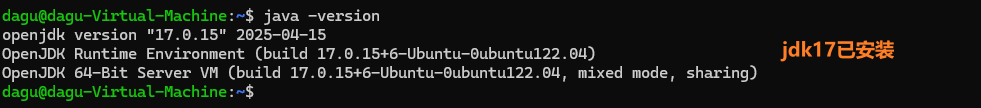

# Linux平台常规部署

!> 常规部署时，LCP只提供前端部署包app.zip，后端部署文件server.jar及配置模板文件，其他环境依赖项需要自行准备。

## 依赖环境

以下内容是需要您自行准备、安装、运行的。

- `Nginx服务器`：用于启动LCP的前端部分（1.18.x及其以上，主流版本均可）
- `JDK17`：用于启动LCP的后端服务
- `MySQL`：用于存储LCP的数据（版本5.7-8.0均可）

##### linux环境下可以通过如下命令确认依赖的安装状态：

```shell
sudo nginx -t
````


```shell
sudo systemctl status mysql
```


```shell
java -version
```



## 部署文件

以下是window常规部署时LCP向您提供的部署文件清单

- `app.zip`: 前端源码包，需要配合nginx进行部署
- `server.jar`: 后端jar包，需要配合MySQL + JDK17进行部署
- `license.zip`: LCP授权文件，请购买后在LCP官网申请下载
- `application.yml`: LCP后端配置文件,需要配合后端服务使用
- `nginx.conf`: nginx配置文件，需要配合nginx进行部署

## 修改配置文件

配置文件的调整请参考[配置文件](deploy/部署配置文件.md)

## 启动后端服务

当准备好上述内容后在server.jar文件同级目录下运行如下命令启动后端服务。

```shell
java -javaagent:server.jar -jar server.jar --spring.config.location=\path\to\application.yml
````

如果你的jdk没有配置系统环境变量，则需要使用jdk的全路径启动服务

```shell
/jdk/path/bin/java -javaagent:server.jar -jar server.jar --spring.config.location=/path/to/application.yml
```

?> --spring.config.location=/path/to/application.yml 为后端配置文件的路径，无比指定该参数，才可读取到你自定义的配置

执行上述命令首次启动服务时，由于没有授权文件无法启动。控制台中会输出当前机器的识别码。


复制识别码，登录[LCP官网](http://www.lcpdesigner.cn)，申请、下载授权文件。


将下载的license.zip文件放置到server.jar同级目录下，重新使用上述命令启动服务即可。启动成功会输出服务端口号


## 启动前端服务

!> 将自定义的nginx.conf放置在/etc/nginx/cong.d目录下是主流做法，但并不是唯一的做法。请结合实际情况进行操作。

根据[配置文件](deploy/部署配置文件.md)调整完nginx.conf配置后，将其复制到/etc/nginx/conf.d/目录下并运行如下命令检查nginx配置文件是否正确

```shell
sudo nginx -t
```

若有如下输出，则说明配置文件无误，反之则根据提示修改配置文件。


使用命令启动nginx服务

!> 不同linux发行版、不同的安装方式，操作命令可能会有所不同，请结合自身实际情况进行操作。操作逻辑步骤都一样。

```shell
# 查看nginx运行状态
sudo systemctl status nginx
# 若未启动，则使用命令启动
sudo systemctl start nginx
# 若已启动，则使用命令重新加载配置文件
sudo nginx -s reload
```

## 访问使用LCP

在上述操作成功后，根据nginx.conf中配置的ip和端口访问LCP页面。默认账户 admin / 123456

