# 功能节点

蓝图功能节点用于辅助页面组件间的逻辑处理，帮助高效完整组件间的联动效果。

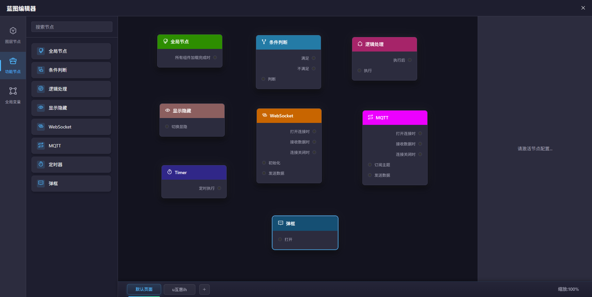

逻辑节点一般用于组件触发事件后的自定义逻辑处理。当前的逻辑节点包含了条件判断、逻辑处理节点

## 全局节点

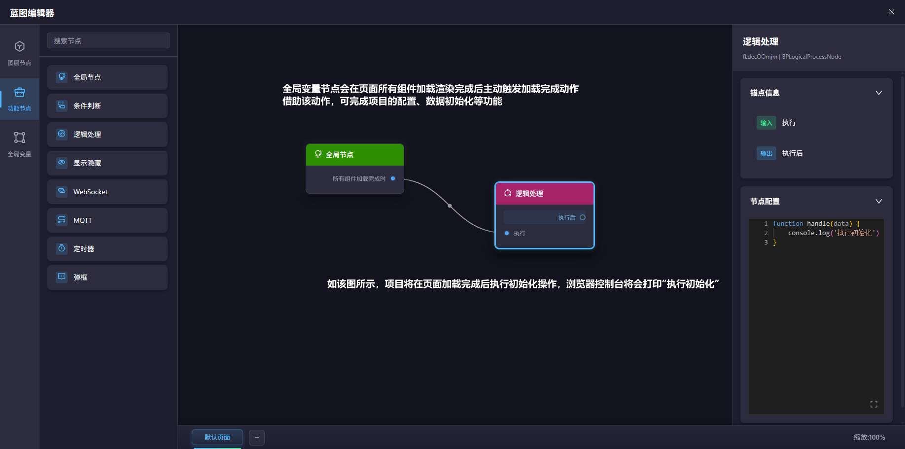

## 条件判断节点

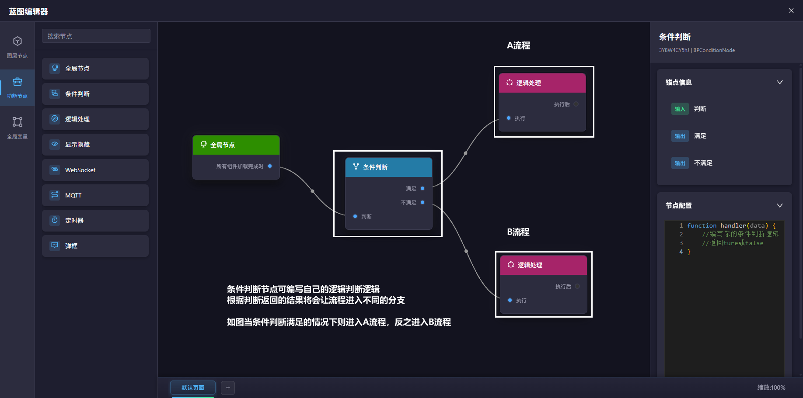

## 逻辑处理节点

## 显示隐藏节点

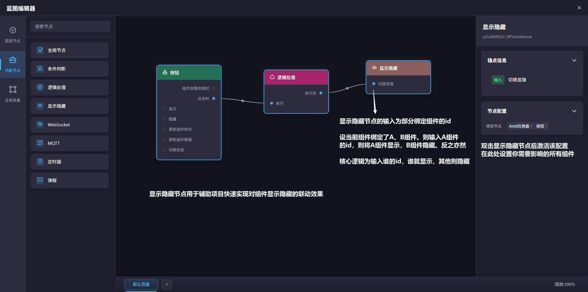

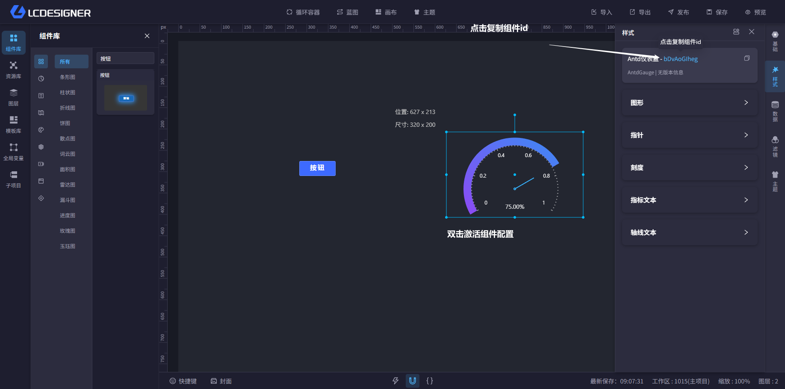

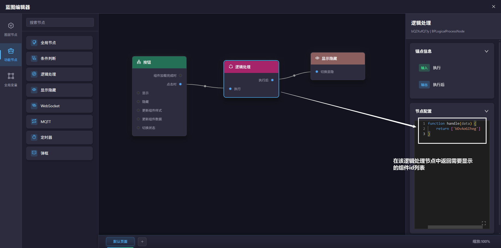

## WebSocket节点

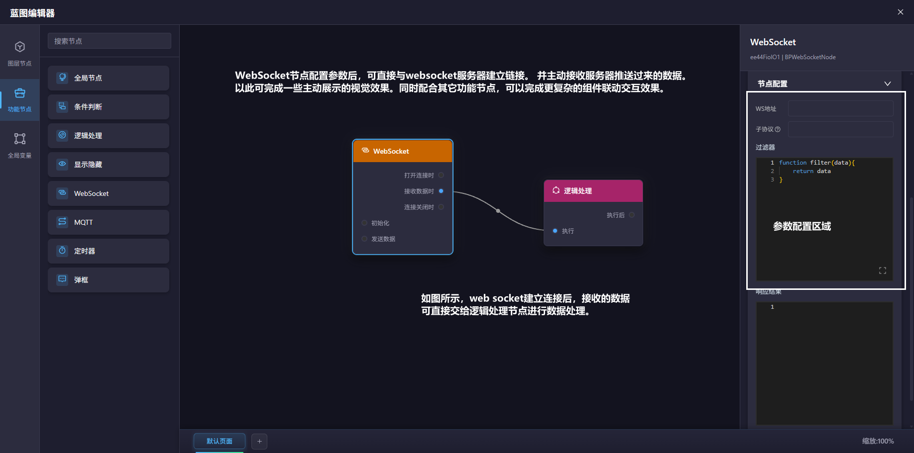

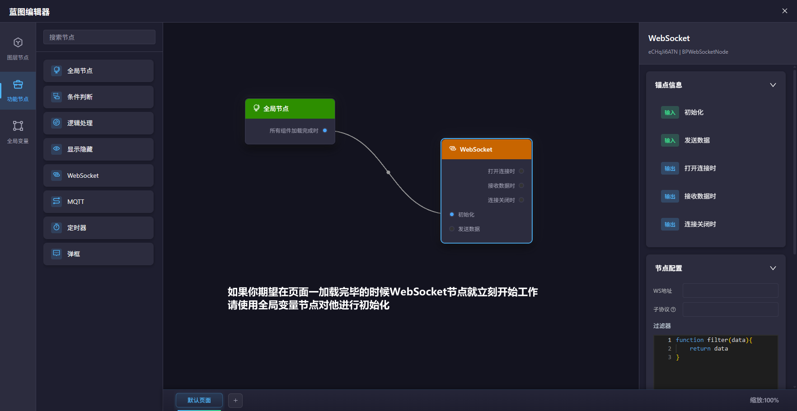

## MQTT节点

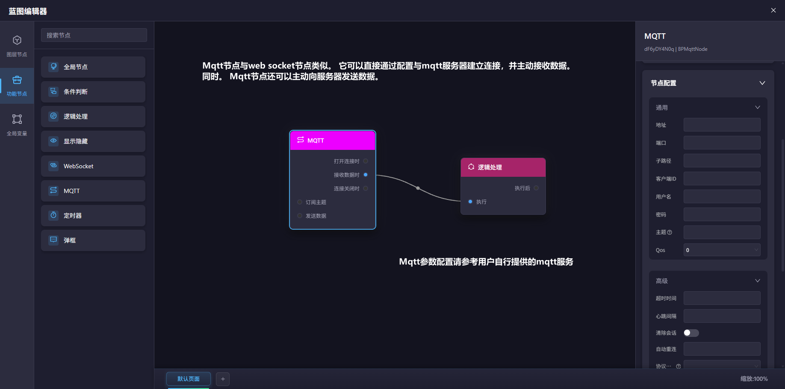
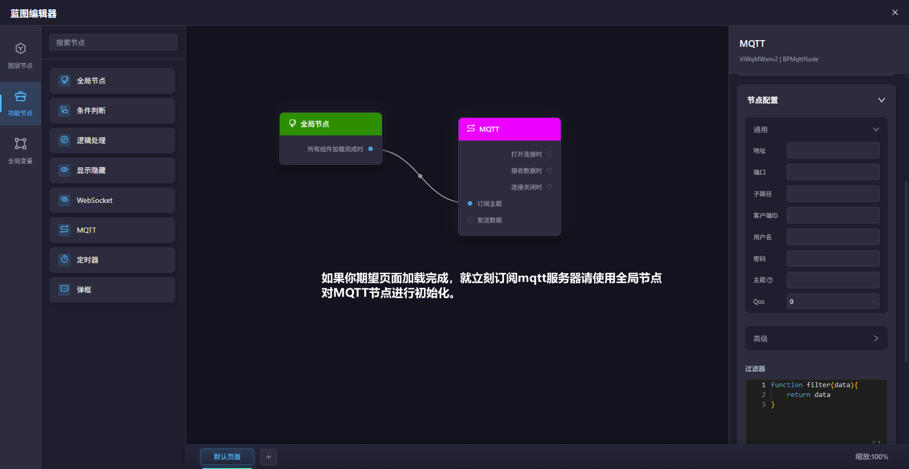
## 定时器节点

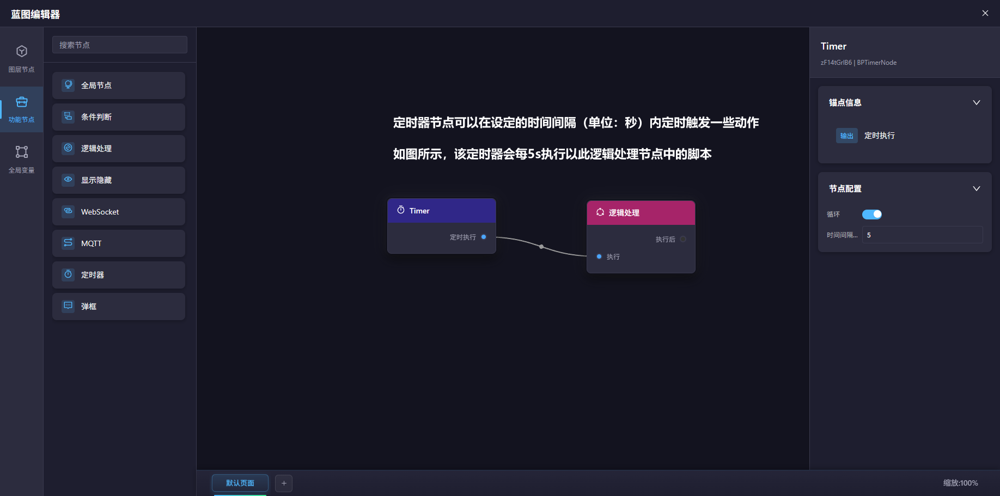

## 弹框节点

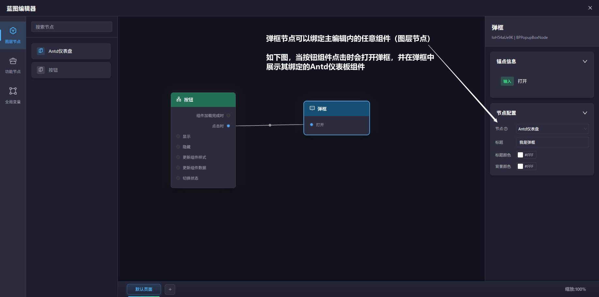

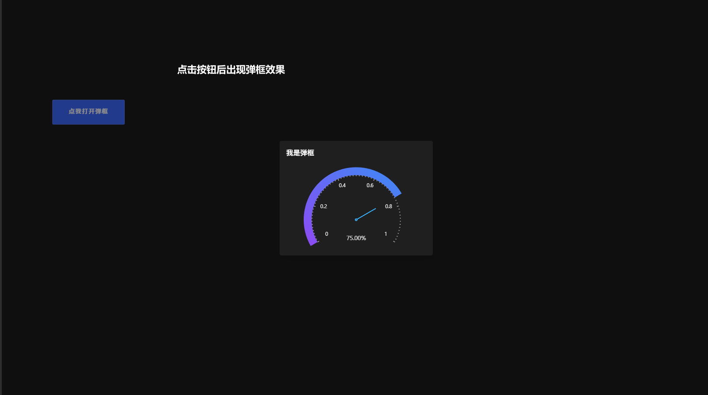