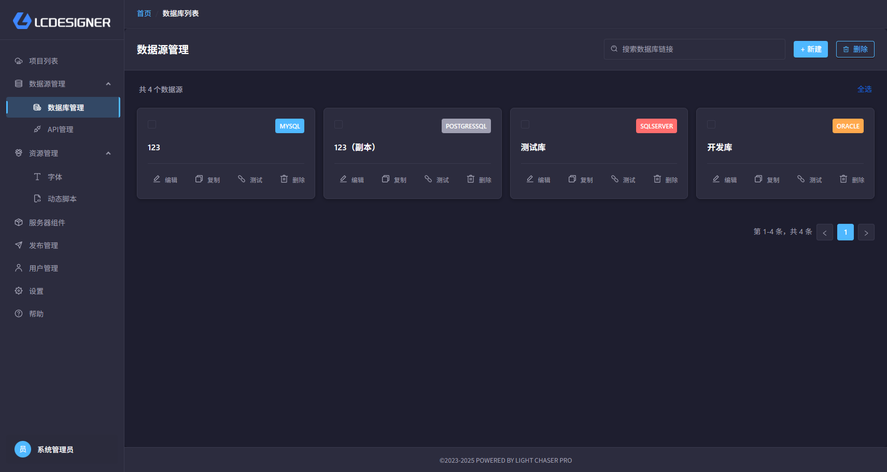
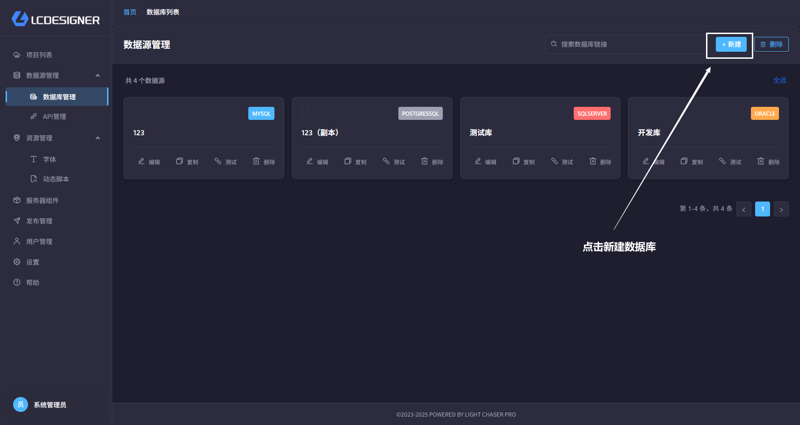
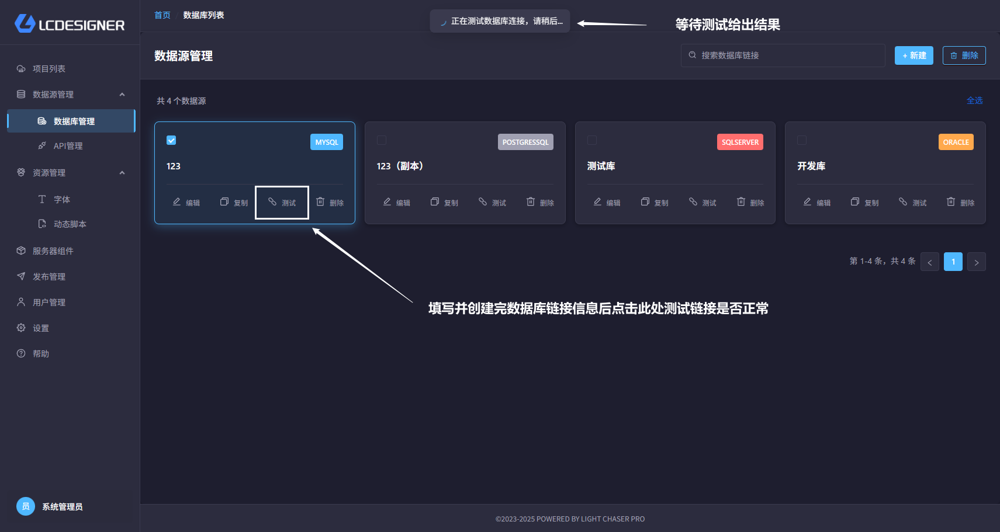
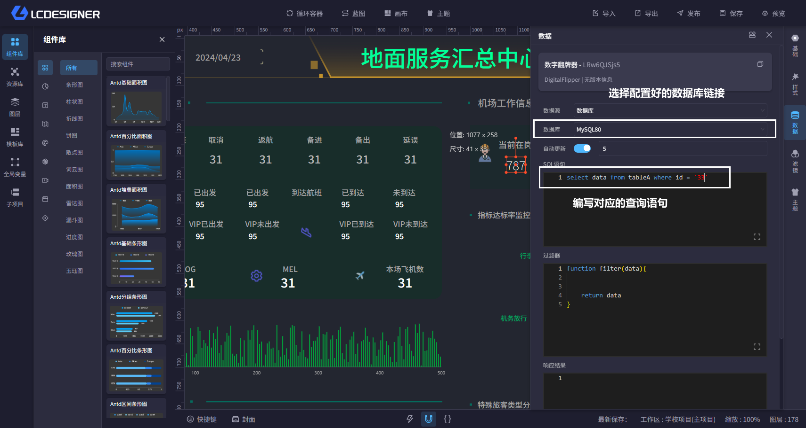
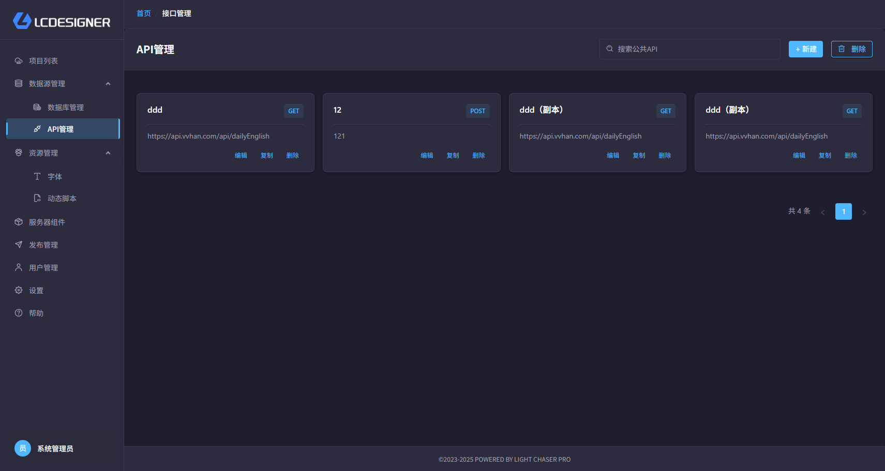
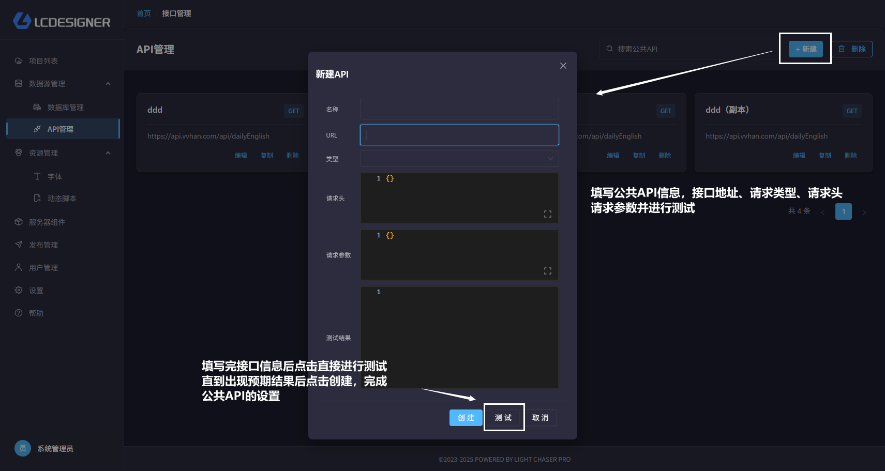
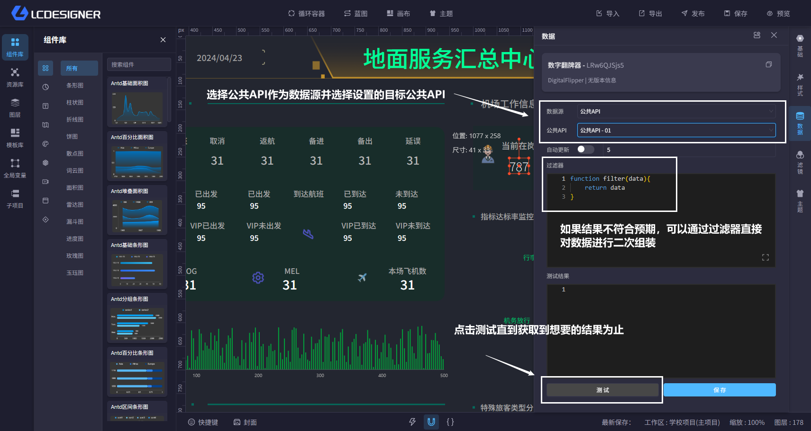

# 数据源管理

## 总览

数据源管理是统一管理LIGHT CHASER PRO中公共数据源的地方。所谓公共数据源也就是配置一次，可在多个项目中重复使用。

现有的公共数据源包含数据库数据源、公共API数据源

## 数据库数据源

所有支持数据源的组件均支持数据库数据源，由于数据库数据源需要提前建立数控链接，因此需要在此处统一维护每个不同种类数据库的链接信息。目前已支持的数据库类型如下：

- MySQL
- PostgreSQL
- SQL Server
- Oracle

#### 新建数据库链接

#### 测试数据库连接

#### 使用数据库数据源

!> 注：数据库作为数据源仅支持以`select`开头的SQL语句，任何非`select`语句或者试图直接修改数据库数据的操作都是被禁止的

## API数据源

#### 创建公共API

#### 使用公共API

