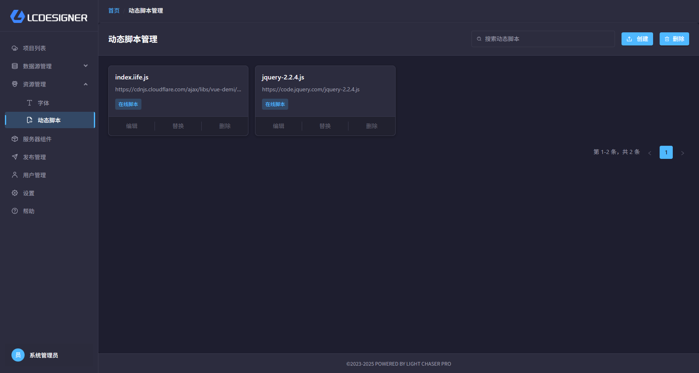
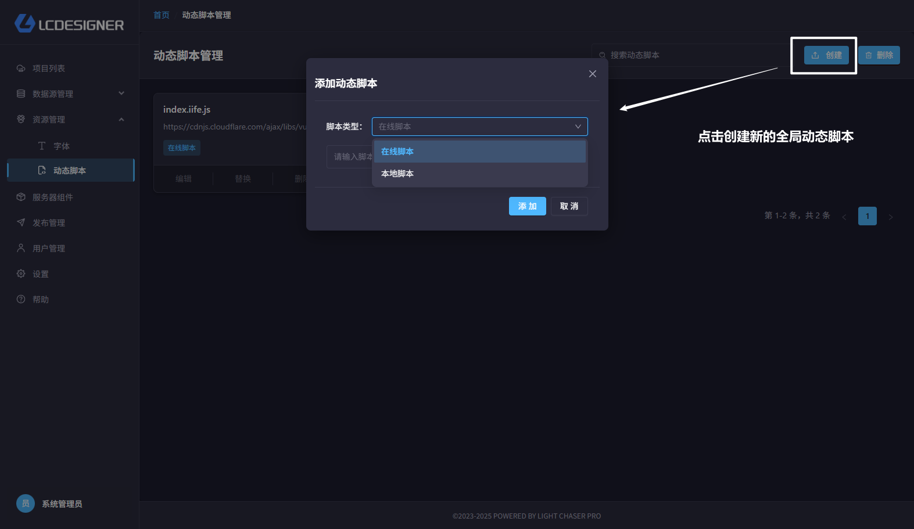
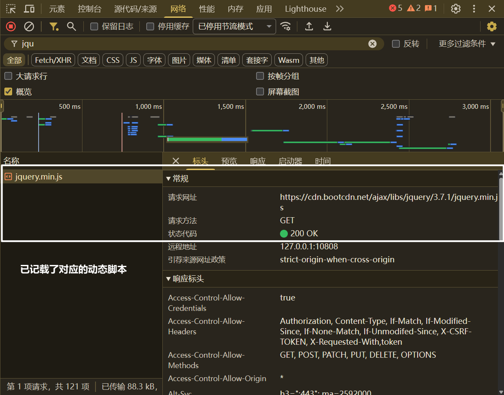
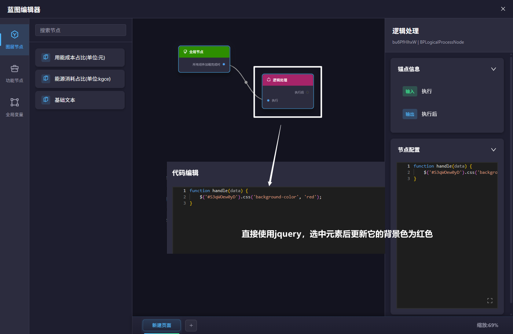

# 全局动态脚本

## 总览

很多时候，项目为了实现更多的功能效果，往往需要在项目运行的阶段依赖第三方的工具库或者效果库。全局动态脚本可以很好的支持这一需求。和传统的
开发模式一样，全局动态脚本配置后你就可以在所有项目中使用对应的脚本库或者效果库。

?> 全局动态脚本的生效范围是所有项目。

## 创建动态脚本

动态脚本分为两种类型

- 在线脚本：和传统的js脚本cdn一样，你可以直接通过cdn引入
- 本地脚本：如果你本地开发了一些js脚本工具，则可以将这些脚本手动上传到LCP中。

## 使用全局动态脚本

> 在编辑、预览或发布页面刷新页面时，动态脚本会被加载

