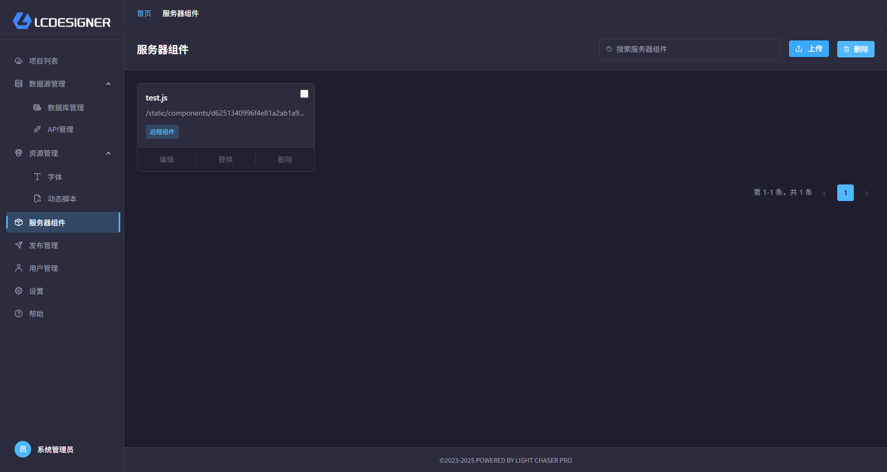
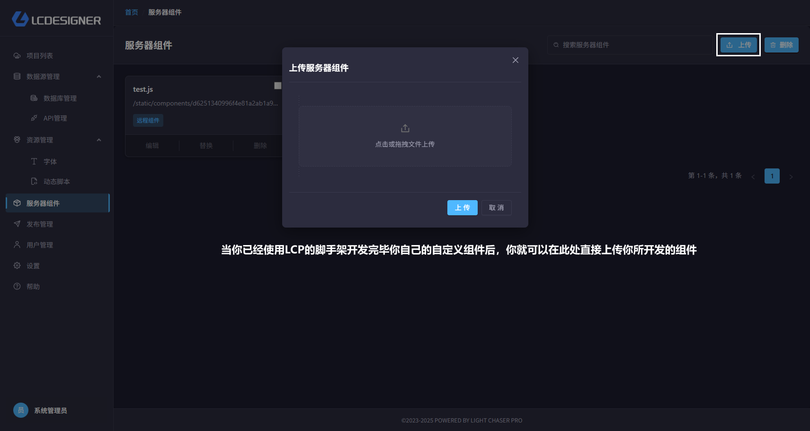

# 服务器组件

## 总览

服务器组件的设计目的是为了扩展自定义组件的多样性。他需要配合LIGHT CHASER PRO提供的开发脚手架一起使用。

你仅需要使用Pro版提供的脚手架，和开发普通React组件一样的开发LIGHT CHASER PRO的服务器组件，开发完毕后通过脚手架打包编译。然后将编译的产物通过服务器组件上传到LIGHT
CHASER服务器，再进入主设计器， 你会发现自己编写的组件已经出现在主设计器的组件列表中，和标准的组件没有任何区别。

?> 脚手架开发组件的详细步骤可参考 [组件开发章节](/develop/develop_pro)

## 上传服务器组件

假设你已经开发好了一个服务器组件，并且已经打包编译了。你可以通过下面的方式上传服务器组件。

