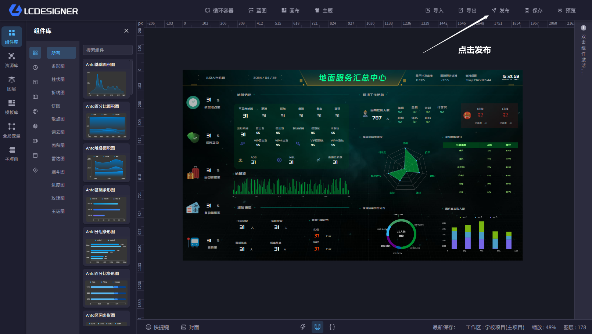
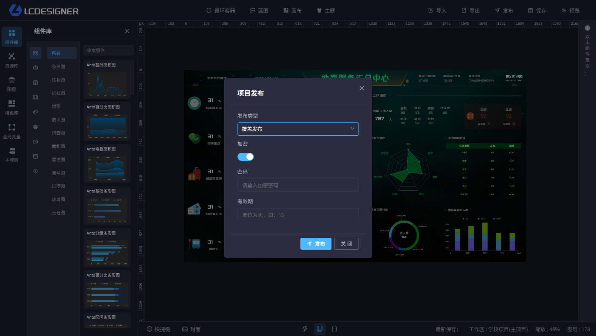

# 发布

当你项目的所有设计工作都完毕后，你可以发布项目。发布的项目会将当前的项目数据单独存储一份并生成一个独立的连接。该连接可以在任意浏览器中直接访问查看项目的最终效果

## 设置发布

#### 发布类型

点击设置发布按钮，出现发布设置的弹框。项目发布有两种类型：

- 覆盖发布：如果当前没有发布，则创建一个发布；如果当前有发布，则覆盖当前的发布效果，链接保持不变
- 增量发布：始终生成新的发布版本，并生成新的发布链接

#### 加密

创建发布时，可以设置是否加密发布。加密发布会生成一个加密的链接，只有通过密码才能访问。

#### 有效器

创建发布时，可以设置发布有效期。单位为(天)，不设置时，默认为永久

> 发布的效果与画布的设置有一定关系，详情可参考[画布设置](functions/main_desiner/canvas.md)