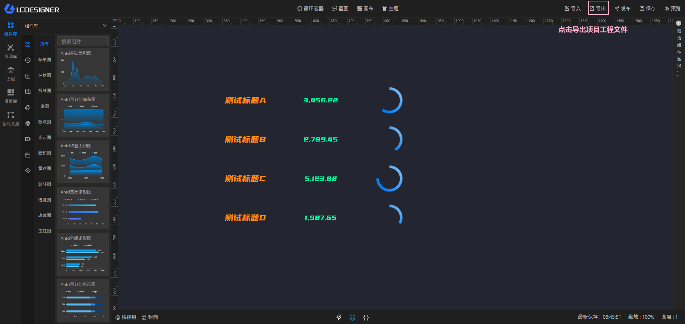

## 演示模式

演示模式可以支持你将设计好的功能项目直接导出，配合纯演示模式的专属部署包进行精简部署，而不需要部署整个LIGHT CHASER PRO的环境

> 纯演示模式是纯前端部署的方式，因此如果你在设计项目的过程中使用了必须连接后端服务的功能，则在纯演示模式中无法正常使用。这些后端功能包含（数据库数据源、公共api数据源）

## 第一步：导出项目



## 第二步：部署演示服务

演示模式也需要部署前端与后端。因此你需要准备以下内容：

1. 前端部署文件（LCP提供）
2. 后端部署文件（jar包，LCP提供）
3. JDK17
4. nginx服务器

演示模式的后端使用SQLite作为数据库，因此不需要单独安装数据库服务。

跟随LIGHT CHASER PRO部署文件的压缩包内会包含一个pure-demo.zip的压缩文件。该文件用于纯演示环境的搭建。部署过程与部署Pro的前端部分类似。需要nginx服务器

### 目录结构

- lcp-pure.jar (用于启动后端服务)
- lcp-pure-app.zip (纯演示模式前端文件)

### 启动后端服务

不论是window环境，还是linux环境，统一使用java -jar命令启动后端服务。（请提前安装好JDK17）

默认启动使用 `java -jar lcp-pure.jar`，如果你想要自定义端口号，或者自定义数据库文件名称，请使用 `java -jar lcp-pure.jar --server.port=8080 --spring.datasource.url=jdbc:sqlite:D:/demo.db`
或者在启动的时候指定外部配置文件，请使用 `java -jar lcp-pure.jar --spring.config.location=D:/application.yml`

application.yml配置文件的内容可以参考：

```yaml
spring:
  application:
    name: lcp-show
  servlet:
    multipart:
      max-file-size: 100MB
      max-request-size: 100MB
  datasource:
    type: com.zaxxer.hikari.HikariDataSource
    driver-class-name: org.sqlite.JDBC
    url: "jdbc:sqlite:${user.dir}/lcp-show.db"
  mybatis-plus:
    mapper-locations: classpath:/mapper/**/*.xml
    configuration:
      map-underscore-to-camel-case: true
server:
  port: 8083

```

### 启动前端服务

1. 将lcp-pure-app.zip解压，并复制到指定的目录下（假设目录为/lcp/pure-app）
2. 修改nginx配置文件（window系统在nginx软件目录的conf目录下，linux通常在/etc/nginx/nginx.conf，取决于你的安装方式，可以通过nginx -t查看配置文件位置）
3. 启动nginx（window下可以直接双击nginx.exe启动。linux下需要通过nginx命令启动）

配置文件示例

```nginx configuration

#user  nobody;
worker_processes  1;

#error_log  logs/error.log;
#error_log  logs/error.log  notice;
#error_log  logs/error.log  info;

#pid        logs/nginx.pid;


events {
    worker_connections  1024;
}


http {
    include       mime.types;
    default_type  application/octet-stream;

    #log_format  main  '$remote_addr - $remote_user [$time_local] "$request" '
    #                  '$status $body_bytes_sent "$http_referer" '
    #                  '"$http_user_agent" "$http_x_forwarded_for"';

    #access_log  logs/access.log  main;

    sendfile        on;
    #tcp_nopush     on;

    #keepalive_timeout  0;
    keepalive_timeout  65;

    #gzip  on;

    server {
            listen       8500;  # 修改为你自己的端口
            server_name  localhost; # 修改为你自己的服务器ip或域名
		
            # 将lcp-pure-app.zip解压后的目录配置到这里
    	    root /lcp/pure-app; 
            index release.html;

            #此处要尤为注意，所有LCP导出的项目都会包含静态资源，将导出的项目解压后，将静态资源目录复制到该目录下
            location /static/ {
                alias C:/Users/DAGU/Desktop/test-pure-demo/static/;  # 替换为导出项目压缩包内的static目录所在路径
                # autoindex off;  # 可选，关闭目录浏览功能
            }

            # 将所有非静态资源的请求重定向到 release.html
            location / {
                try_files $uri $uri/ /release.html;
            }

            location @router {
                rewrite ^.*$ /release.html last;
            }

        }

}

```

参考上方配置文件将pure-demo部署启动后访问：http://localhost:8500/release.html (ip钝口需修改为实际ip和端口) 即可看到如下页面


## 第三步：导入项目

