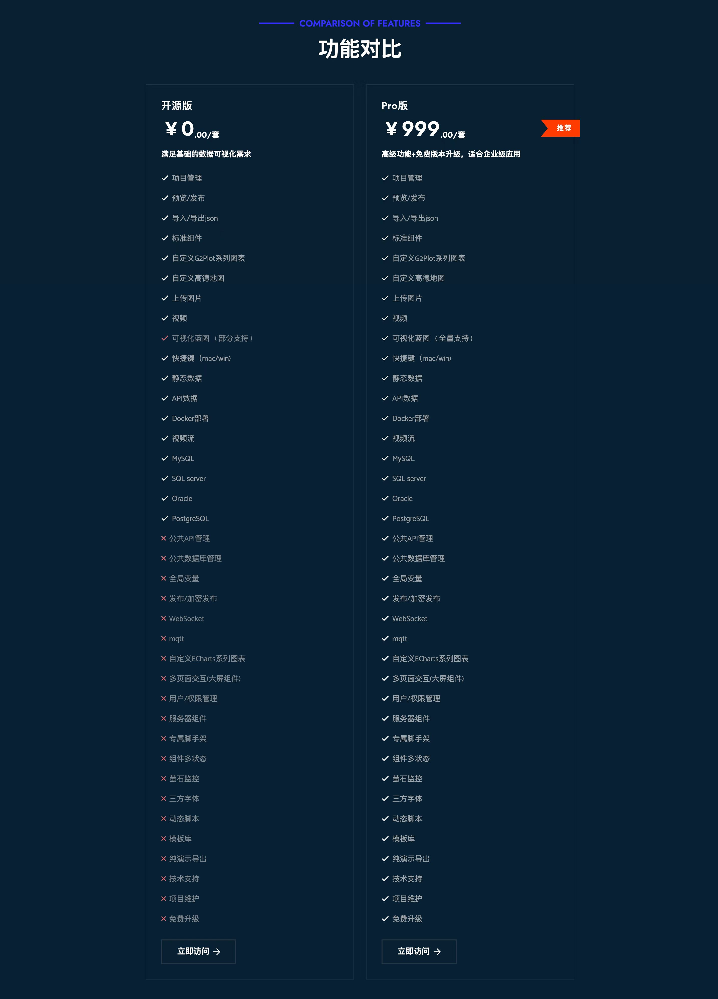

## 产品简介

LIGHT CHASER PRO是一款基于React、TypeScript5等前沿技术栈开发的跨平台的数据可视化设计工具。通过拖拉拽的方式即可实现视觉丰富、美观的数据可视化效果。它适用于大部份数据可视化场景

## 产品优势

- 图表丰富：支持G2Plot原生图表、支持ECharts自定义图表，现有标准组件50+
- 无缝扩展：专享脚手架，无需源码也可快速二次开发自定义组件
- 操作简单：拖拽 + 快捷键，操作简约
- 蓝图事件：可视化事件联动，通过节点连线，即可快速配置组件之间的联动效果
- 快速主题：支持全局主题，滤镜。全局效果一键切换
- 体验流畅：依托成熟的技术生态 + 性能优化，本地缓存。页面流畅无卡顿
- 数据直连：API、数据库等多种数据源支持。请求方式随意切换

## 版本说明

亦可参考 [版本差异](http://www.lcdesigner.cn:9000/index.html)

